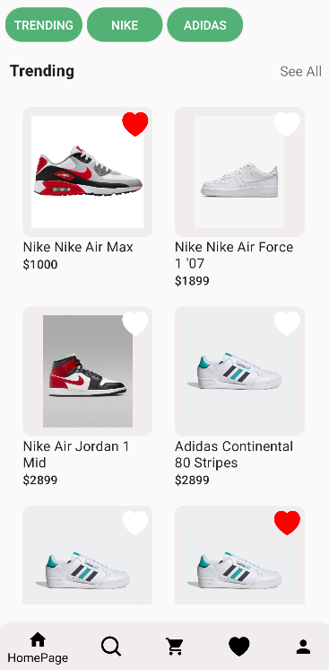
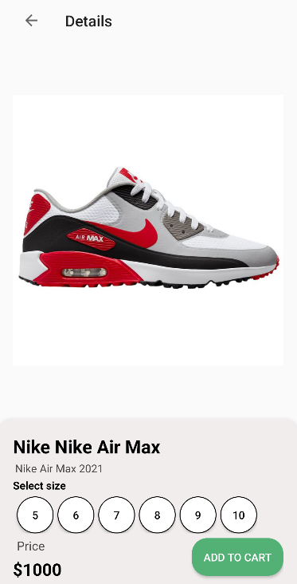
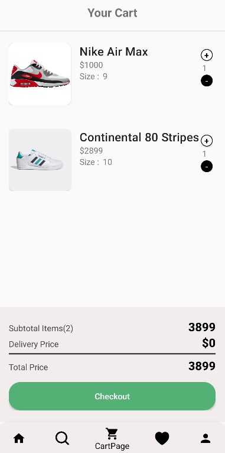
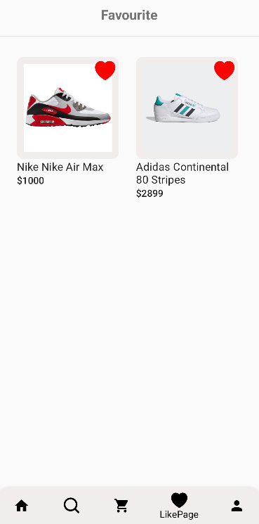
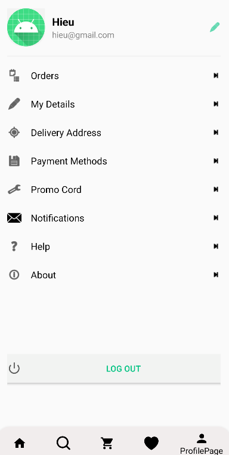

# Shopping App

## Mô tả ứng dụng

`Shopping App` là một ứng dụng Android viết bằng Kotlin (package: `com.hoan.myapplication`). Dựa trên cấu trúc và dependencies, đây có vẻ là một ứng dụng bán hàng/hiển thị sản phẩm (có `ProductActivity`, `SignInActivity`, `SignUpActivity`, `MainActivity` và `SplashActivity`). Ứng dụng sử dụng Firebase (Authentication, Realtime Database và Firestore) để lưu trữ dữ liệu và quản lý người dùng, cùng với Google Sign-In cho xác thực.

## Tính năng chính

- Màn hình Splash (khởi động)
- Đăng nhập (email/password) và Đăng nhập bằng Google
- Đăng ký tài khoản
- Hiển thị danh sách/chi tiết sản phẩm (`ProductActivity`)
- Thêm giỏ hàng và đặt hàng

## Công nghệ sử dụng

- Kotlin
- Android SDK (compileSdk 35, targetSdk 34, minSdk 28)
- Gradle
- ViewBinding
- Android Navigation + SafeArgs
- Firebase: Authentication, Realtime Database, Firestore (sử dụng Firebase BoM)
- Google Play Services Auth (Google Sign-In)
- Glide (tải ảnh)
- Kotlin Coroutines (core + android)
- JDK 11

## Kiến trúc & cấu trúc dự án

- Namespace / applicationId: `com.hoan.myapplication`
- Cấu trúc file: Activities nằm trong `app/src/main/java/.../activities` (theo manifest). Navigation được thêm qua `androidx.navigation`.
- Data layer: sử dụng Firebase (Realtime DB / Firestore) để lưu/đọc dữ liệu.
- UI: hoạt động theo pattern Activity + Navigation; ViewBinding dùng để truy cập view.
- Concurrency: Kotlin Coroutines.

## Các Activity chính

- `.activities.SplashActivity`
- `.activities.MainActivity`
- `.activities.SignInActivity`
- `.activities.SignUpActivity`
- `.activities.ProductActivity`

## Một vài hình giao diện

-

-

-

-

